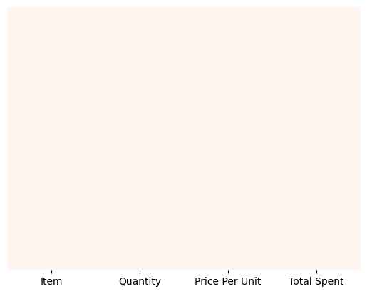

# Cafe-Sales-Analysis
> This project explores the sales of different menu items using a dataset. We perform data cleaning, Exploratory Data Analysis (EDA) analyze the sales report of the cafe.
---
# Data Description
The dataset used here is [dirty_cafe_sales.csv](https://www.kaggle.com/datasets/ahmedmohamed2003/cafe-sales-dirty-data-for-cleaning-training) from **Kaggle**. It contains almost 10 menu items, 10000 records, and 8 columns:

- **Transaction id**
- **Item**
- **Quantity**
- **Price Per Unit**
- **Total Spent**
- **Payment Method**
- **Location**
- **Transaction Date**

---


---

## Project Structure

``` Bash
📦 Cafe-Sales-Analysis
┣ 📜 Main Notebook     # Main notebook
┣ 📊 Datasets          # Dataset (CSV file)
┣ 📷 Images            # Visualizations and outputs
┗ 📄 README.md         # Project overview
```
---

## 🔰 Step-by-Step Breakdown

### 📌 Step 1: Load and preview the Dataset
- Used pandas to load the cafe sales dataset.
- Remove useless columns of the data frame.

### 📌 Step 2: Check the data structure
We check for missing values and data types to understand the structure.

```python
# Basic info and null check
df.info()
```

### 📌 Step 3: Handling error values and converting columns into other data types

We will remove the error values from the dataset. Convert the **Item** column into Category datatype, **Quantity**, **Price Per Unit**, **Total Spent** into float datatype also remove the non-numeric characters.

---
## EDA with Plots for important Interpretations

### 📌 Step 4: Visualizing the dataset for useful insights

In this step, we will make some graphs to get important information about the cafe sales. We are using different plots like:

- **Heatmap:** To check missing values
- **histogram:** To get the graph of the quantity of each Item ordered
- **Pie chart:** To view the contribution of each item total sales
- **Bar plot:** Total revenue per Item
- **Point plot:** Average transaction value per Item
- **Box plot:** Spending Distribution per Item

#### 1. 📷 Heatmap:
The heatmap shows that we have cleaned the dataset efficiently, and we have no missing values.


#### 2. 📷 Histogram:
This histogram shows the distribution of each menu Item.


#### 3. 📷 Pie chart:
The pie chart shows the quantity and sales per menu Item.

**For Quantity sold per Item**


**For sales per Item**


#### 4. 📷 Bar plot:
A bar plot is best for showing overall revenue


#### 5. 📷 Point plot:
The point plot shows the average spending when ordering each item.


#### 6. 📷 Box Plot: 
Box plot reveals transaction patterns and outliers.


#### **Plots with properties:**

| **Plot Type** | **What it shows**                                            | **Best For**
| :-------------| :----------------------------------------------------------- | :-------------
| **Heatmap**   | Missing values in dataset                                    | Quickly identifying columns/rows with data quality issues
| **Histogram** | Distribution of numeric values                               | Understanding value ranges and spotting outliers
| **Pie chart** | Percentage contribution of each menu item to total sales     | Visualizing market share of products at a glance
| **Bar plot**  | Total revenue generated by each menu item                    | Identifying top-selling products and revenue drivers
| **Point plot**| Average spending per transaction for each item               | Menu pricing analysis and comparing per-item transaction values
| **Box plot**  | Spending distribution, median, and range for each item       | Identifying popular order sizes and detecting unusual spending pattern

---
### 📌 Step 5: Save the cleaned dataset

``` python
# Saving the cleaned dataset into csv
df.to_csv('cleaned_data.csv', index=True)
```
---
## 🔍 Final Findings:

- Each menu item is ordered almost **equal number** of times.
- The most expensive Item is **salad**. 
- **Coffee** is the most popular item ordered.
- The cheapest Item on the menu is **cookie**

---
## 💻 Run It Yourself

### 1. Clone the repository

```bash
git clone https://github.com/fahadkhalid695/Cafe-Sales-Analysis.git
cd Cafe-Sales-Analysis/Main Notebook
```
### 2. Open the Jupyter notebook

**cafe-sale.ipynb**

---
## 🧠 Skills Demonstrated

📌 Data Cleaning & EDA

📌 Data Visualization with Matplotlib & Seaborn

📌 Python Libraries: Pandas, NumPy, Scikit-learn

---
## 📂 Dataset Source

📈 [Cafe Sales](https://www.kaggle.com/datasets/ahmedmohamed2003/cafe-sales-dirty-data-for-cleaning-training)

---
## 📮 Connect with Me

### 🔗 LinkedIn
[Fahad Khalid](https://www.linkedin.com/in/fahadkhalid695/)


###  GitHub
[Fahad Khalid](https://github.com/fahadkhalid695)

